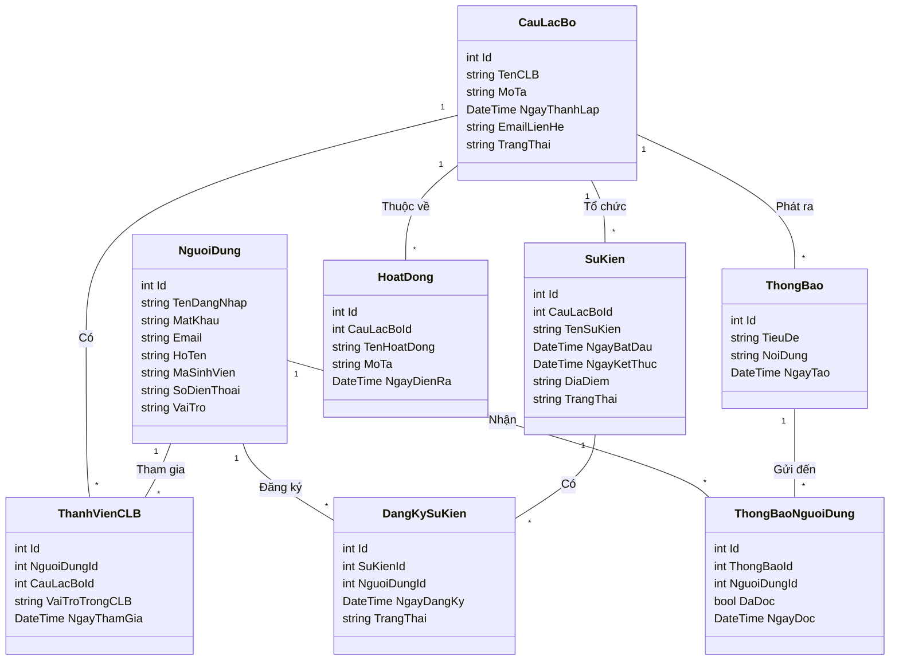

```mermaid
classDiagram
    class NguoiDung {
        int Id
        string TenDangNhap
        string MatKhau
        string Email
        string HoTen
        string MaSinhVien
        string SoDienThoai
        string VaiTro
    }
    class CauLacBo {
        int Id
        string TenCLB
        string MoTa
        DateTime NgayThanhLap
        string EmailLienHe
        string TrangThai
    }
    class ThanhVienCLB {
        int Id
        int NguoiDungId
        int CauLacBoId
        string VaiTroTrongCLB
        DateTime NgayThamGia
    }
    class SuKien {
        int Id
        int CauLacBoId
        string TenSuKien
        DateTime NgayBatDau
        DateTime NgayKetThuc
        string DiaDiem
        string TrangThai
    }
    class DangKySuKien {
        int Id
        int SuKienId
        int NguoiDungId
        DateTime NgayDangKy
        string TrangThai
    }
    class HoatDong {
        int Id
        int CauLacBoId
        string TenHoatDong
        string MoTa
        DateTime NgayDienRa
    }
    class ThongBao {
        int Id
        string TieuDe
        string NoiDung
        DateTime NgayTao
    }
    class ThongBaoNguoiDung {
        int Id
        int ThongBaoId
        int NguoiDungId
        bool DaDoc
        DateTime NgayDoc
    }

    NguoiDung "1" -- "*" ThanhVienCLB : Tham gia
    CauLacBo "1" -- "*" ThanhVienCLB : Có
    CauLacBo "1" -- "*" SuKien : Tổ chức
    CauLacBo "1" -- "*" HoatDong : Thuộc về
    CauLacBo "1" -- "*" ThongBao : Phát ra
    SuKien "1" -- "*" DangKySuKien : Có
    NguoiDung "1" -- "*" DangKySuKien : Đăng ký
    ThongBao "1" -- "*" ThongBaoNguoiDung : Gửi đến
    NguoiDung "1" -- "*" ThongBaoNguoiDung : Nhận
```
